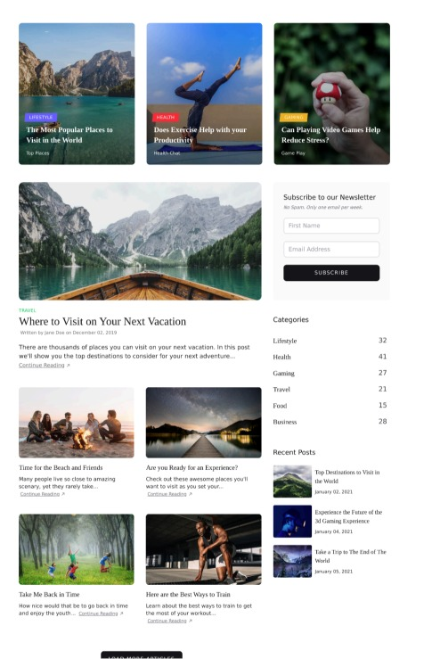
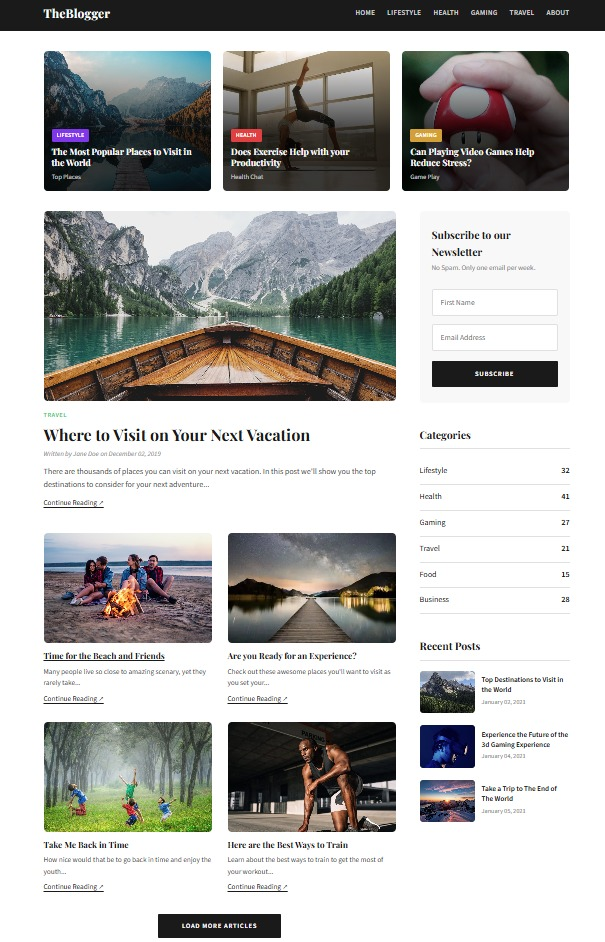

# TAREA 1 — Clon de Sección principal de Sitio Real

**Curso:** Ingenieria de spoftware
**Estudiante:** Juan Carlos Jiménez Castrillo (C33980)

## Sitio clonado
Blog de ejemplo (ver imagen original abajo)

## Descripción
Este proyecto consiste en clonar la sección principal de un blog real utilizando únicamente HTML semántico y CSS puro, sin frameworks ni JavaScript. El objetivo es demostrar dominio de estructura semántica, organización de archivos CSS externos y aplicación correcta de la cascada y especificidad.

## Estructura
- HTML5 semántico: `<header>`, `<nav>`, `<main>`, `<section>`, `<aside>`, `<footer>`
- CSS externo: `src/css/styles.css` con variables, Google Fonts, y comentarios de especificidad
- Imágenes locales en `src/assets/img/`
- Formulario funcional en el sidebar

## Screenshots

### Sitio original

[Ver imagen original en Google Drive](https://drive.google.com/file/d/1plUlxGx6HuG433RVZNHbNtaI4vMHVYFC/view)

### Resultado (clon)

> _Para comparar, abre ambos en pestañas separadas._

---

**Repositorio público:** [tarea1-clon-web](https://github.com/JCarlosJimenezC/tarea1-clon-web)
**Link para clonar Repositorio público:** [tarea1-clon-web](https://github.com/JCarlosJimenezC/tarea1-clon-web.git)
**Link github page :** [tarea1-clon-web](https://jcarlosjimenezc.github.io/tarea1-clon-web/)
---

> _Entrega para evaluación. No se usaron frameworks ni JavaScript._
